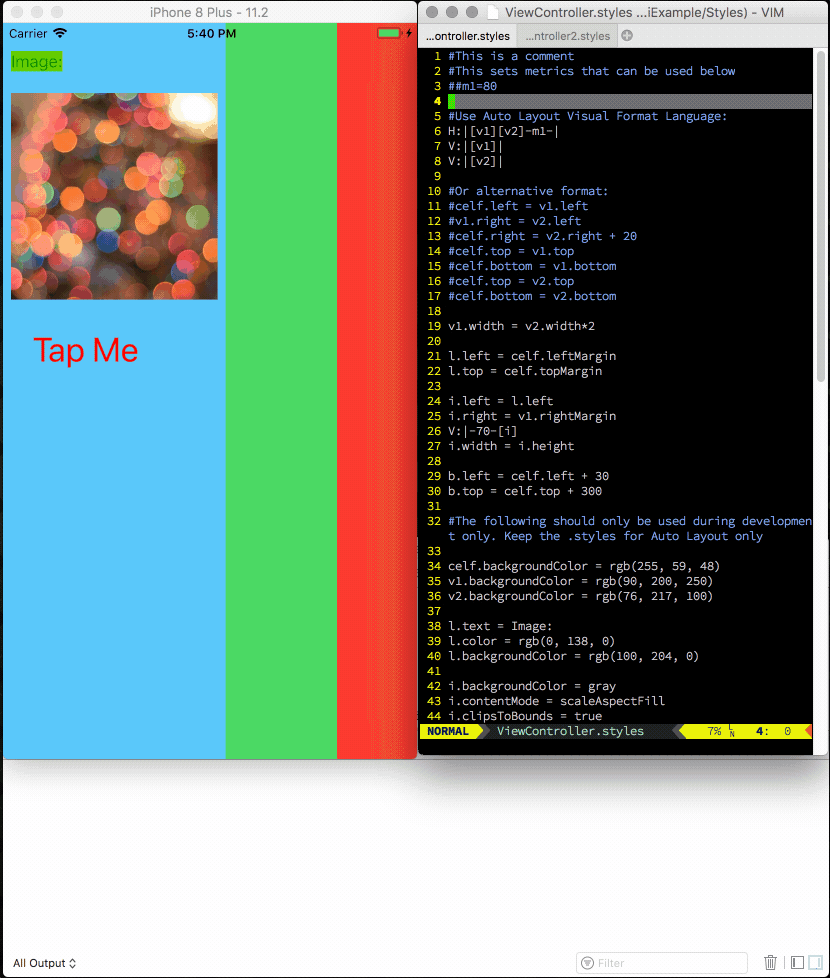

# Zhi
Swift Library for Live Reloading Auto Layout Constraints on iOS

Adjust Auto Layout constraints and watch your app update immediately without a rebuild + run cycle.

Save precious time.

Usage
---
This library allows you to specify your auto layout constraints in separate `.styles` files. It supports:

* Live reloading of Auto Layout constraints as you save the `.styles` files, without a rebuild + run cycle
* Apple's Visual Format Language: `H:[p(==v2)]|`
* Support an equations-based syntax: `v1.width = v2.width + 10`

In addition, the `.styles` files also support:

* Metrics can be specified
* Colors — rgb(), rgba() or named colors in `UIColor`, e.g. `red`
* Image filenames
* Button title and label text
* Font name, size
* Dynamic type style names, e.g. `callout` or `caption1`
* and more

This means that you can tweak these properties without rebuilding your app during development.

*WARNING: Setting of properties like colors are best used in style files only during development. Ship style files that only contains instructions for Auto Layout.*

There is an [example app](https://github.com/hboon/Zhi/tree/master/Example) included in the repository.

### Setup

The library works best if you style based on UIViewController subclasses.

Refer to [Installation](#installation) to install the library

1. Create a UIViewController subclass
2. Add a property: `lazy var styler = zhiCreateStyler()`
3. Override `viewDidLoad()` and create a `mainView` and add it to the view controller's view. You will add all other subviews to `mainView` instead of the view controller's view directory:

        mainView.frame = view.bounds
        mainView.autoresizingMask = [.flexibleWidth, .flexibleHeight]
        view.addSubview(mainView)
4. Add the following to the end of `viewDidLoad()` (replacing the value for `views` and `metrics` accordingly):

        styler.views = ["celf": mainView, "v1": v1, "v2": v2]
        styler.metrics = ["m": 100, "k": 50]
        styler.keepTranslateAutoResizingMaskForView = mainView
        styler.liveReload(view: view)
        view.setNeedsUpdateConstraints()
5. Override `updateViewConstraints()`:

        override func updateViewConstraints() {
            styler.style(view: mainView)
            super.updateViewConstraints()
        }
6. In your app delegate, add (during development):

    Zhi.Styler.logEnabled = true
7. Create a directory call `Styles` and create 1 style file for each view controller. If your view controller called `MyViewController`, name the file `MyViewController.styles`

This is enough to get the library to style your view controller.

To get live reload to work, you need to pass in the path of the directory containing your styles to the library. The cleanest way to do this without duplication is to specify it in your `Info.plist` file.

1. In Xcode project settings for your target, click `Build Settings`
2. Click the `+` button to add a `User-Defined Setting`.
3. Name the setting `STYLES_DIRECTORY`
4. Set the value to the `Styles/` directory. eg.: `$(SRCROOT)/ZhiExample/Styles/`
5. Delete the value for all release builds. (When this value is empty, the library will not attempt to live reload styles). See [example](https://raw.githubusercontent.com/hboon/Zhi/master/Images/user-defined-setting.png).
6. Open your `Info.plist` file (or click Info in project settings)
7. Add a property called `STYLES_DIRECTORY`
8. Set the value to: `$(STYLES_DIRECTORY)`. See [example](https://raw.githubusercontent.com/hboon/Zhi/master/Images/Info.plist.png).

### Styles Files Syntax
---
Styles files are line-based. Empty lines are ignored

Comments start with a single `#`

    # This is a comment

Metrics start with `##`

    ##m1=80

Visual Format Language:

    H:|[v1][v2]-m1-|

Equation-based syntax:

    v1.width = v2.width*2

Properties:

    v1.backgroundColor = rgb(90, 200, 250)

    i.backgroundColor = gray
    i.contentMode = scaleAspectFill
    i.clipsToBounds = true
    i.image = color.jpeg

    b.title = Tap Me
    b.textStyle = largeTitle

    l.fontName = Thonburi
    l.fontSize = 30
    l.numberOfLines = 0

Quirks & Gotchas
---
Constraints especially those written in Visual Format Language are passed directly to to Auto Layout, so errors might crash the app like it normally does.

This library is currently only for `iOS`.

Installation
---
Zhi is available through [CocoaPods](http://cocoapods.org).

### CocoaPods

In order to install Zhi using CocoaPods, add the following line to your Podfile:

    pod "Zhi"

Dependencies
---
* [KZFileWatchers](https://github.com/krzysztofzablocki/KZFileWatchers)

License
---
BSD 2-clause. See LICENSE file.

More
---
Zhi is based on my previous library [purplish-layout](https://github.com/hboon/purplish-layout) written in [RubyMotion](http://www.rubymotion.com). It's also inspired by [@twerth](https://twitter.com/twerth)'s [rmq](https://github.com/infinitered/rmq) (also in RubyMotion). Some of the parsing code is shamelessly lifted from [@marcoarment](https://twitter.com/marcoarment)'s [CompactConstraint](https://github.com/marcoarment/CompactConstraint)

Questions
---
* Email: [hboon@motionobj.com](mailto:hboon@motionobj.com)
* Web: [http://hboon.com/zhi](http://hboon.com/zhi)
* Twitter: [@hboon](https://twitter.com/hboon)
